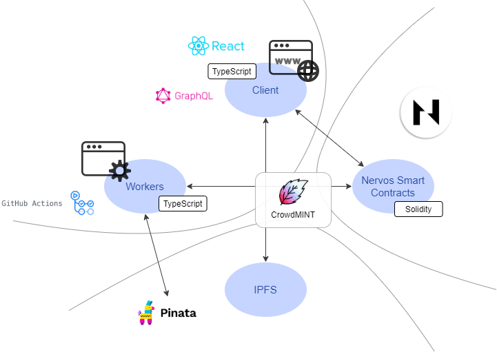

# CrowdMINT

Decentralized crowdfunding on [Nervos Network](https://www.nervos.org/).

<p align="center">
	
</p>

CrowdMINT is a blockchain based solution leveraging NFTs to crowdfund community projects.

The developed smart contract supports both the fixed AON (All-Or-Nothing) and the flexible KIA (Keep-It-All) [crowdfunding models](https://www.researchgate.net/publication/272306935_Crowdfunding_Models_Keep-it-All_vs_All-or-Nothing).
A big advantage of smart contracts is most of the fees known from conventional crowdfunding platforms are eliminated.
However, possible business uses cases could involve a small fee when creating projects or after successful campaigns, directly programmed into the smart contract.

Typical crowdfunding campaigns offer rewards to contributors for specific amounts. On top of that, CrowdMINT plans to leverage NFTs to incentivize funders.
By choosing this option, the amount above the funding goal will be distributed to the holders of minted NFTs and based on the percentage defined by the campaign creator.

Example:

- Funding goal was set to 100'000 CKB and reached 500'000 CKB
- 50% of the amount above goal will be distributed to eligible funders
- NFT minting was limited to 100 with a unit price of 1'000 CKB
- Funder A minted 2 NFTs
- Funder B minted 10 NFTs

Both funders A and B not only contributed to make this crowdfunding project a success but also get a ROI.

- 50% of 400'000 CKB = 200'000 CKB is distributed among eligible funders
- Funder A gets 2% of 200'000 CKB = 4'000 CKB (2'000 CKB profit)
- Funder B gets 10% of 200'000 CKB = 20'000 CKB (10'000 CKB profit)

A decentralized crowdfunding solution such as CrowdMINT could have an exponential impact on the community leading to a higher number of successful projects started on Nervos.

#### Table of Content:
* [Demo](#demo)
* [Architecture](#architecture)
* [Roadmap](#roadmap)
* [Setup](#setup)

## Demo <a name="demo"></a>

Video Walkthrough: [...](...)

Live Demo: [https://www.crowdmint.fi/](https://www.crowdmint.fi/)

Before accessing the live demo, please make sure to complete the following steps:
- [Setup Godwoken Network in MetaMask](#metamask)
- [Create a Godwoken Account by Making a Layer 2 Deposit](#deposit)

## Architecture <a name="architecture"></a>

<h1 align="center">
	
</h1>

The contracts can be found in the [contracts](/contracts) folder.
They are built using [Solidity](https://docs.soliditylang.org/en/v0.7.6/) in combination with [Hardhat](https://hardhat.org/).

The workers can be found in the [workers](/workers) folder. 
They are built using [TypeScript](https://www.typescriptlang.org/) and run as part of [GitHub Actions](https://github.com/features/actions).
[Pinata](https://www.pinata.cloud/) was selected in order to pin data hosted on [IPFS](https://ipfs.io/).

The frontend can be found in the [client](/client) folder. 
It is built using [React](https://reactjs.org/) and [GraphQL](https://graphql.org/) in combination with [TypeScript](https://www.typescriptlang.org/). 
For design & layout purposes the [Material UI](https://mui.com/) framework has been chosen.

All components are using [Polyjuice Provider](https://github.com/nervosnetwork/polyjuice-provider) to interact with Nervos Layer 2 (Godwoken).

## Roadmap <a name="roadmap"></a>

### 2021.Q4
Alpha release on Nervos Layer 2 Godwoken Testnet with the focus on functionalities for a minimum viable product.

- Start new projects as a creator
- Contribute to projects as an individual
- Withdraw as a creator or individual

### 2022.Q1
Implement [ERC-721](https://ethereum.org/en/developers/docs/standards/tokens/erc-721/) Non-Fungible Token standard.

- Enable project creators to leverage NFTs to incentivize funders
- Mint project NFTs and collect NFT rewards as an individual
- Beta release on Nervos Layer 2 Godwoken Testnet

### 2022.Q2
Public release on Nervos Layer 2 Godwoken Mainnet.

- Security audit of smart contracts
- Automatized social media promotion covering trending projects

## Setup <a name="setup"></a>

The setup is split into 3 parts; [contracts](/contracts), [workers](/workers) and [client](/client). All parts require [Node](https://nodejs.org/en/) v14+ and [Yarn](https://yarnpkg.com/getting-started/install) to be installed.

To install all dependencies just run the following command in the folder containing this README:

```bash
yarn install-all
```

### Setup Godwoken Network in MetaMask <a name="metamask"></a>
https://github.com/Kuzirashi/gw-gitcoin-instruction/blob/master/src/tasks/7.port.eth.dapp.md

<details open>
<summary>Godwoken Testnet</summary>
<pre>
Network Name: Godwoken Testnet
RPC URL: https://godwoken-testnet-web3-rpc.ckbapp.dev
Chain ID: 71393
Currency Symbol: &lt;Leave Empty&gt;
Block Explorer URL: &lt;Leave Empty&gt;
</pre>
</details>

<details>
<summary>Godwoken Devnet</summary>
<pre>
Network Name: Godwoken Devnet
RPC URL: http://localhost:8024
Chain ID: 1024777
Currency Symbol: &lt;Leave Empty&gt;
Block Explorer URL: &lt;Leave Empty&gt;
</pre>
</details>

### Create a Godwoken Account by Making a Layer 2 Deposit <a name="deposit"></a>
https://github.com/Kuzirashi/gw-gitcoin-instruction/blob/master/src/component-tutorials/4.layer2.deposit.md